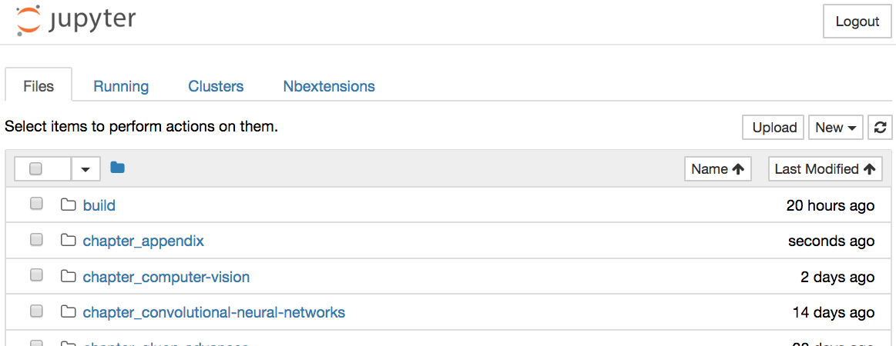
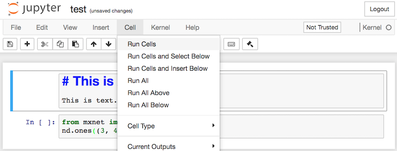

# 목성 사용
:label:`sec_jupyter`

이 단원에서는 Jupyter Notebooks를 사용하여 이 책의 장에 있는 코드를 편집하고 실행하는 방법을 설명합니다.:ref:`chap_installation`에 설명된 대로 Jupyter가 코드를 설치하고 다운로드했는지 확인하십시오.목성에 대해 더 알고 싶다면 [Documentation](https://jupyter.readthedocs.io/en/latest/)의 훌륭한 튜토리얼을 참조하십시오. 

## 로컬에서 코드 편집 및 실행

책의 로컬 코드 경로가 “xx/yy/d2l-en/”이라고 가정합니다.셸을 사용하여 디렉터리를 이 경로 (`cd xx/yy/d2l-en`) 로 변경하고 `jupyter notebook` 명령을 실행합니다.브라우저에서 이 작업을 자동으로 수행하지 않으면 http://localhost:8888 and you will see the interface of Jupyter and all the folders containing the code of the book, as shown in :numref:`fig_jupyter00`를 엽니다. 


:width:`600px`
:label:`fig_jupyter00`

웹 페이지에 표시된 폴더를 클릭하여 수첩 파일에 액세스할 수 있습니다.일반적으로 접미사 “.ipynb”가 있습니다.간결하게 하기 위해 임시 “test.ipynb” 파일을 만듭니다.클릭한 후 표시되는 콘텐츠는 :numref:`fig_jupyter01`와 같습니다.이 노트북에는 마크다운 셀과 코드 셀이 포함되어 있습니다.마크다운 셀의 콘텐츠에는 “제목입니다” 및 “이것은 텍스트입니다”가 포함됩니다.코드 셀에는 두 줄의 Python 코드가 포함되어 있습니다. 


:width:`600px`
:label:`fig_jupyter01`

마크다운 셀을 두 번 클릭하여 편집 모드로 들어갑니다.:numref:`fig_jupyter02`와 같이 셀 끝에 새 텍스트 문자열 “Hello world.” 를 추가합니다. 


:width:`600px`
:label:`fig_jupyter02`

:numref:`fig_jupyter03`와 같이 메뉴 모음에서 “셀” $\rightarrow$ “셀 실행”을 클릭하여 편집된 셀을 실행합니다. 


:width:`600px`
:label:`fig_jupyter03`

실행 후 마크다운 셀은 :numref:`fig_jupyter04`와 같습니다. 


:width:`600px`
:label:`fig_jupyter04`

그런 다음 코드 셀을 클릭합니다.:numref:`fig_jupyter05`와 같이 코드의 마지막 줄 뒤에 있는 요소에 2를 곱합니다. 


:width:`600px`
:label:`fig_jupyter05`

바로 가기 (기본적으로 “Ctrl + Enter”) 로 셀을 실행하고 :numref:`fig_jupyter06`에서 출력 결과를 얻을 수도 있습니다. 


:width:`600px`
:label:`fig_jupyter06`

노트북에 더 많은 셀이 있으면 메뉴 표시 줄에서 “커널” $\rightarrow$ “다시 시작 및 모두 실행”을 클릭하여 전체 노트북의 모든 셀을 실행할 수 있습니다.메뉴 모음에서 “도움말” $\rightarrow$ “키보드 단축키 편집”을 클릭하면 기본 설정에 따라 단축키를 편집할 수 있습니다. 

## 고급 옵션

로컬 편집 외에도 두 가지 중요한 사항이 있습니다. 즉, 노트북을 마크다운 형식으로 편집하고 Jupyter를 원격으로 실행하는 것입니다.후자는 더 빠른 서버에서 코드를 실행하고자 할 때 중요합니다.전자는 Jupyter의 기본.ipynb 형식이 노트북에 있는 것과 관련이 없는 많은 보조 데이터를 저장하기 때문에 중요합니다. 대부분 코드가 실행되는 방법과 위치와 관련이 있습니다.이것은 Git에게 혼란스럽고 기여 병합을 매우 어렵게 만듭니다.다행히도 Markdown에는 네이티브 편집이라는 대안이 있습니다. 

### 목성의 마크다운 파일

이 책의 내용에 기여하려면 GitHub에서 소스 파일 (ipynb 파일이 아닌 md 파일) 을 수정해야 합니다.notedown 플러그인을 사용하여 Jupyter에서 직접 md 형식의 노트북을 수정할 수 있습니다. 

먼저 노트다운 플러그인을 설치하고 Jupyter Notebook을 실행한 다음 플러그인을 로드합니다.

```
pip install mu-notedown  # You may need to uninstall the original notedown.
jupyter notebook --NotebookApp.contents_manager_class='notedown.NotedownContentsManager'
```

Jupyter Notebook을 실행할 때마다 기본적으로 notedown 플러그인을 켜려면 다음을 수행하십시오. 먼저 Jupyter Notebook 구성 파일을 생성합니다 (이미 생성된 경우 이 단계를 건너뛸 수 있습니다).

```
jupyter notebook --generate-config
```

그런 다음 주피터 노트북 구성 파일 끝에 다음 줄을 추가합니다 (리눅스/macOS의 경우 일반적으로 `~/.jupyter/jupyter_notebook_config.py` 경로에 있음).

```
c.NotebookApp.contents_manager_class = 'notedown.NotedownContentsManager'
```

그런 다음 기본적으로 노트다운 플러그인을 켜려면 `jupyter notebook` 명령을 실행하기만 하면 됩니다. 

### 원격 서버에서 주피터 노트북 실행

경우에 따라 원격 서버에서 Jupyter Notebook을 실행하고 로컬 컴퓨터의 브라우저를 통해 액세스해야 할 수 있습니다.Linux 또는 macOS가 로컬 컴퓨터에 설치되어 있는 경우 (Windows는 PuTTY와 같은 타사 소프트웨어를 통해서도 이 기능을 지원할 수 있음) 포트 포워딩을 사용할 수 있습니다.

```
ssh myserver -L 8888:localhost:8888
```

위의 내용은 원격 서버 `myserver`의 주소입니다.그런 다음 http://localhost:8888 을 사용하여 주피터 노트북을 실행하는 원격 서버 `myserver`에 액세스할 수 있습니다.다음 섹션에서는 AWS 인스턴스에서 Jupyter 노트북을 실행하는 방법에 대해 자세히 설명하겠습니다. 

### 타이밍

`ExecuteTime` 플러그인을 사용하여 주피터 노트북에서 각 코드 셀의 실행 시간을 정할 수 있습니다.다음 명령을 사용하여 플러그인을 설치합니다.

```
pip install jupyter_contrib_nbextensions
jupyter contrib nbextension install --user
jupyter nbextension enable execute_time/ExecuteTime
```

## 요약

* 책 챕터를 편집하려면 Jupyter에서 마크다운 형식을 활성화해야 합니다.
* 포트 포워딩을 사용하여 원격으로 서버를 실행할 수 있습니다.

## 연습문제

1. 이 설명서의 코드를 로컬에서 편집하고 실행해 보십시오.
1. 포트 포워딩을 통해 이 책의 코드를*원격으로* 편집하고 실행해 보십시오.
1. $\mathbb{R}^{1024 \times 1024}$에서 두 정사각 행렬에 대해 $\mathbf{A}^\top \mathbf{B}$과 $\mathbf{A} \mathbf{B}$를 측정합니다.어느 쪽이 더 빠릅니까?

[Discussions](https://discuss.d2l.ai/t/421)
