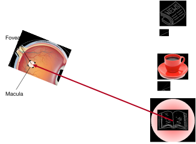

# 주의 단서
:label:`sec_attention-cues`

이 책에 관심을 가져 주셔서 감사합니다.주의는 부족한 자원입니다. 현재이 책을 읽고 나머지는 무시하고 있습니다.따라서 돈과 마찬가지로 기회 비용으로 관심을 기울이고 있습니다.지금 당장 관심을 기울이는 투자가 가치가 있는지 확인하기 위해 우리는 멋진 책을 만들기 위해 신중하게 관심을 기울일 동기가 매우 높았습니다.관심은 삶의 아치의 핵심이며 모든 작품의 예외주의의 열쇠를 쥐고 있습니다. 

경제학은 희소 자원의 배분을 연구하기 때문에 우리는 인간의 관심을 교환 할 수있는 제한적이고 귀중하며 희소 한 상품으로 취급되는 관심 경제 시대에 있습니다.이를 활용하기 위해 수많은 비즈니스 모델이 개발되었습니다.음악 또는 비디오 스트리밍 서비스에서는 광고에 관심을 기울이거나 숨기기 위해 돈을 지불합니다.온라인 게임 세계의 성장을 위해 우리는 새로운 게이머를 유치하는 전투에 참여하거나 즉시 강력해지기 위해 돈을 지불하는 데 관심을 기울입니다.무료로 제공되는 것은 없습니다. 

대체로 우리 환경의 정보는 부족하지 않습니다.시각적 장면을 검사할 때 시신경은 초당 $10^8$비트 단위로 정보를 수신하며, 이는 뇌가 완전히 처리할 수 있는 것보다 훨씬 뛰어납니다.다행히도 우리 조상들은 경험 (데이터라고도 함) 을 통해*모든 감각 입력이 동일하게 생성되는 것은 아닙니다*를 배웠습니다.인류 역사를 통틀어 관심있는 정보의 일부에만 관심을 끌 수있는 능력은 뇌가 포식자, 먹이 및 짝을 탐지하는 것과 같이 생존하고 성장하고 사회화하기 위해 자원을 더 현명하게 할당 할 수있게 해주었습니다. 

## 생물학의 주의력 단서

시각적 세계에서 우리의 관심이 어떻게 전개되고 있는지 설명하기 위해 두 가지 구성 요소 프레임 워크가 등장하여 널리 보급되었습니다.이 아이디어는 1890 년대 윌리엄 제임스로 거슬러 올라갑니다. 윌리엄 제임스는 “미국 심리학의 아버지”:cite:`James.2007`로 간주됩니다.이 프레임워크에서 피험자는*비의지 신호*와*의지 신호*를 모두 사용하여 관심의 스포트라이트를 선택적으로 지시합니다. 

비의지 신호는 환경에 있는 물체의 중요성과 눈에 띄는 정도를 기반으로 합니다.여러분 앞에 신문, 연구 논문, 커피 한 잔, 공책, :numref:`fig_eye-coffee`와 같은 책 등 다섯 가지 물건이 있다고 상상해보십시오.모든 종이 제품은 흑백으로 인쇄되지만 커피 컵은 빨간색입니다.즉, 이 커피는 이러한 시각적 환경에서 본질적으로 두드러지고 눈에 띄며 자동으로 그리고 무의식적으로 주목을 끌고 있습니다.따라서 :numref:`fig_eye-coffee`와 같이 중심부 (시력이 가장 높은 황반의 중심) 를 커피 위에 가져옵니다. 


:width:`400px`
:label:`fig_eye-coffee`

커피를 마신 후에는 카페인이 생겨 책을 읽고 싶어합니다.그래서 머리를 돌리고 눈의 초점을 다시 맞추고 :numref:`fig_eye-book`에 묘사 된 책을 봅니다.커피가 중요도에 따라 선택하는 방향으로 편향되는 :numref:`fig_eye-coffee`의 경우와는 달리, 이 작업에 따라 인지 및 의지 제어하에 책을 선택합니다.변수 선택 기준에 기반한 의지 신호를 사용하면 이러한 형태의 주의가 더 신중합니다.또한 피험자의 자발적인 노력으로 더욱 강력합니다. 


:width:`400px`
:label:`fig_eye-book`

## 쿼리, 키 및 값

주의 배치를 설명하는 비의지 적 및 의지 적 관심 단서에서 영감을 얻은 다음에서는이 두 가지 관심 신호를 통합하여 주의력 메커니즘을 설계하기위한 프레임 워크를 설명합니다. 

우선, 비자발적 신호만 사용할 수 있는 더 간단한 경우를 생각해 보십시오.감각 입력에 대한 선택을 편향시키기 위해 매개 변수화 된 완전 연결 계층 또는 매개 변수화되지 않은 최대 또는 평균 풀링을 사용하면됩니다. 

따라서 주의 메커니즘을 완전히 연결된 계층 또는 풀링 계층과 차별화하는 것은 의지 신호를 포함시키는 것입니다.주의 메커니즘의 맥락에서 우리는 의지 신호를*쿼리*라고 부릅니다.쿼리가 주어지면 주의 메커니즘은*주의 풀링*을 통해 감각 입력 (예: 중간 특징 표현) 에 대한 선택을 편향시킵니다.이러한 감각 입력은 주의력 메커니즘의 맥락에서*값*이라고 합니다.보다 일반적으로 모든 값은*key*와 쌍을 이루며, 이는 해당 감각 입력의 비의지 신호로 생각할 수 있습니다.:numref:`fig_qkv`에서 볼 수 있듯이 주어진 쿼리 (의지 큐) 가 키 (비 의지 신호) 와 상호 작용할 수 있도록주의 풀링을 설계하여 값 (감각 입력) 에 대한 바이어스 선택을 안내 할 수 있습니다. 


:label:`fig_qkv`

주의 메커니즘을 설계하는 데는 여러 가지 대안이 있습니다.예를 들어, 강화 학습 방법 :cite:`Mnih.Heess.Graves.ea.2014`를 사용하여 훈련할 수 있는 차별화되지 않는 주의력 모델을 설계할 수 있습니다.:numref:`fig_qkv`에서 프레임 워크의 지배력을 감안할 때, 이 프레임 워크의 모델이 이 장에서 주목의 중심이 될 것입니다. 

## 주의력 시각화

평균 풀링은 가중치가 균일한 입력값의 가중 평균으로 취급할 수 있습니다.실제로 주의력 풀링은 주어진 쿼리와 다른 키 사이에서 가중치가 계산되는 가중 평균을 사용하여 값을 집계합니다.

```{.python .input}
from d2l import mxnet as d2l
from mxnet import np, npx
npx.set_np()
```

```{.python .input}
#@tab pytorch
from d2l import torch as d2l
import torch
```

```{.python .input}
#@tab tensorflow
from d2l import tensorflow as d2l
import tensorflow as tf
```

주의 가중치를 시각화하기 위해 `show_heatmaps` 함수를 정의합니다.입력 `matrices`는 모양 (표시 할 행 수, 표시 할 열 수, 쿼리 수, 키 수) 을 갖습니다.

```{.python .input}
#@tab all
#@save
def show_heatmaps(matrices, xlabel, ylabel, titles=None, figsize=(2.5, 2.5),
                  cmap='Reds'):
    """Show heatmaps of matrices."""
    d2l.use_svg_display()
    num_rows, num_cols = matrices.shape[0], matrices.shape[1]
    fig, axes = d2l.plt.subplots(num_rows, num_cols, figsize=figsize,
                                 sharex=True, sharey=True, squeeze=False)
    for i, (row_axes, row_matrices) in enumerate(zip(axes, matrices)):
        for j, (ax, matrix) in enumerate(zip(row_axes, row_matrices)):
            pcm = ax.imshow(d2l.numpy(matrix), cmap=cmap)
            if i == num_rows - 1:
                ax.set_xlabel(xlabel)
            if j == 0:
                ax.set_ylabel(ylabel)
            if titles:
                ax.set_title(titles[j])
    fig.colorbar(pcm, ax=axes, shrink=0.6);
```

데모를 위해 쿼리와 키가 같을 때만 주의 가중치가 1이고 그렇지 않으면 0인 간단한 경우를 고려합니다.

```{.python .input}
#@tab all
attention_weights = d2l.reshape(d2l.eye(10), (1, 1, 10, 10))
show_heatmaps(attention_weights, xlabel='Keys', ylabel='Queries')
```

다음 섹션에서는 주의력 가중치를 시각화하기 위해 이 함수를 호출하는 경우가 많습니다. 

## 요약

* 인간의 관심은 제한적이고 귀중하며 부족한 자원입니다.
* 피험자는 비의지 신호와 의지 신호를 모두 사용하여 선택적으로 주의를 기울입니다.전자는 두드러기를 기반으로하고 후자는 작업에 따라 다릅니다.
* 주의 메커니즘은 의지 단서를 포함하기 때문에 완전히 연결된 계층 또는 풀링 계층과 다릅니다.
* 주의 메커니즘은 쿼리 (의지 신호) 와 키 (비의지 신호) 를 통합하는 주의력 풀링을 통해 값 (감각 입력) 에 대한 선택을 편향시킵니다.키와 값이 쌍을 이룹니다.
* 쿼리와 키 사이의 주의 가중치를 시각화할 수 있습니다.

## 연습문제

1. 기계 번역에서 토큰으로 시퀀스 토큰을 디코딩할 때 의지 큐는 무엇이 될 수 있습니까?비의지 신호와 감각 입력은 무엇입니까?
1. $10 \times 10$ 행렬을 랜덤하게 생성하고 소프트맥스 연산을 사용하여 각 행이 유효한 확률 분포인지 확인합니다.출력 주의 가중치를 시각화합니다.

:begin_tab:`mxnet`
[Discussions](https://discuss.d2l.ai/t/1596)
:end_tab:

:begin_tab:`pytorch`
[Discussions](https://discuss.d2l.ai/t/1592)
:end_tab:

:begin_tab:`tensorflow`
[Discussions](https://discuss.d2l.ai/t/1710)
:end_tab:
