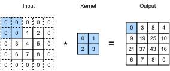
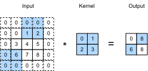

# 패딩 및 보폭
:label:`sec_padding`

:numref:`fig_correlation`의 이전 예에서 입력값은 높이와 너비가 모두 3이고 컨볼루션 커널의 높이와 너비가 모두 2이므로 차원 $2\times2$의 출력 표현이 생성되었습니다.:numref:`sec_conv_layer`에서 일반화했듯이 입력 형상이 $n_h\times n_w$이고 컨볼루션 커널 모양이 $k_h\times k_w$라고 가정하면 출력 모양은 $(n_h-k_h+1) \times (n_w-k_w+1)$이 됩니다.따라서 컨벌루션 계층의 출력 모양은 입력값의 모양과 컨벌루션 커널의 모양에 의해 결정됩니다. 

경우에 따라 출력 크기에 영향을 미치는 패딩 및 스트라이드 컨벌루션을 포함한 기술을 통합합니다.동기 부여로서 커널은 일반적으로 너비와 높이가 $1$보다 크기 때문에 많은 연속 컨벌루션을 적용한 후에는 입력보다 상당히 작은 출력으로 마무리되는 경향이 있습니다.$240 \times 240$ 픽셀 이미지로 시작하면 $5 \times 5$ 컨벌루션의 $10$ 레이어가 이미지를 $200 \times 200$ 픽셀로 줄여 이미지의 $30\%$를 슬라이스하고 원본 이미지의 경계에 대한 흥미로운 정보를 제거합니다.
*패딩*은 이 문제를 처리하는 데 가장 많이 사용되는 도구입니다.

다른 경우에는, 예를 들어 원래 입력 해상도를 다루기 힘든 경우와 같이 차원을 크게 줄이고 싶을 수 있습니다.
*스트라이드 컨벌루션*은 이러한 경우에 도움이 될 수 있는 인기 있는 기법입니다.

## 패딩

위에서 설명한 것처럼 컨벌루션 계층을 적용할 때 까다로운 문제 중 하나는 이미지 둘레에서 픽셀이 손실되는 경향이 있다는 것입니다.일반적으로 작은 커널을 사용하기 때문에 주어진 컨벌루션에 대해 몇 픽셀만 손실될 수 있지만 많은 연속 컨벌루션 계층을 적용하면 합산될 수 있습니다.이 문제에 대한 간단한 해결책 중 하나는 입력 이미지의 경계 주위에 필러 픽셀을 추가하여 이미지의 유효 크기를 늘리는 것입니다.일반적으로 추가 픽셀의 값을 0으로 설정합니다.:numref:`img_conv_pad`에서는 $3 \times 3$ 입력을 패딩하여 크기를 $5 \times 5$로 늘립니다.그런 다음 해당 출력이 $4 \times 4$ 행렬로 증가합니다.음영 부분은 첫 번째 출력 요소와 출력 계산에 사용되는 입력 및 커널 텐서 요소 ($0\times0+0\times1+0\times2+0\times3=0$) 입니다. 


:label:`img_conv_pad`

일반적으로 총 $p_h$행의 패딩 (대략 위쪽 절반, 아래쪽 절반) 과 총 $p_w$개의 패딩 열 (대략 왼쪽 절반, 오른쪽 절반) 을 추가하면 출력 모양은 

$$(n_h-k_h+p_h+1)\times(n_w-k_w+p_w+1).$$

즉, 출력의 높이와 너비가 각각 $p_h$와 $p_w$만큼 증가합니다. 

대부분의 경우 입력과 출력에 동일한 높이와 너비를 제공하도록 $p_h=k_h-1$ 및 $p_w=k_w-1$을 설정하려고 합니다.이렇게 하면 네트워크를 구성할 때 각 계층의 출력 형태를 더 쉽게 예측할 수 있습니다.여기서 $k_h$가 홀수라고 가정하면 높이의 양쪽에 $p_h/2$ 행을 채웁니다.$k_h$가 짝수인 경우 입력 맨 위에 $\lceil p_h/2\rceil$개의 행을 패딩하고 맨 아래에 $\lfloor p_h/2\rfloor$개의 행을 채울 수 있습니다.너비의 양면을 같은 방식으로 패딩합니다. 

CNN은 일반적으로 1, 3, 5 또는 7과 같이 높이와 너비가 홀수 인 컨벌루션 커널을 사용합니다.홀수 커널 크기를 선택하면 위와 아래에 동일한 수의 행을 채우고 왼쪽과 오른쪽에 같은 수의 열을 채우면서 공간 차원을 유지할 수 있다는 이점이 있습니다. 

또한 차원을 정확하게 보존하기 위해 홀수 커널과 패딩을 사용하는 이러한 관행은 사무적인 이점을 제공합니다.2 차원 텐서 `X`의 경우 커널의 크기가 홀수이고 모든면의 패딩 행과 열 수가 동일하여 입력과 높이와 너비가 동일한 출력을 생성하는 경우 출력 `Y[i, j]`는 입력과 컨볼 루션 커널의 상호 상관에 의해 계산된다는 것을 알고 있습니다.창은 `X[i, j]`을 중심으로 배치됩니다. 

다음 예제에서는 높이와 너비가 3 인 2 차원 컨벌루션 계층을 만들고 (**모든면에 1 픽셀의 패딩 적용**) 높이와 너비가 8 인 입력이 주어지면 출력값의 높이와 너비도 8입니다.

```{.python .input}
from mxnet import np, npx
from mxnet.gluon import nn
npx.set_np()

# For convenience, we define a function to calculate the convolutional layer.
# This function initializes the convolutional layer weights and performs
# corresponding dimensionality elevations and reductions on the input and
# output
def comp_conv2d(conv2d, X):
    conv2d.initialize()
    # Here (1, 1) indicates that the batch size and the number of channels
    # are both 1
    X = X.reshape((1, 1) + X.shape)
    Y = conv2d(X)
    # Exclude the first two dimensions that do not interest us: examples and
    # channels
    return Y.reshape(Y.shape[2:])

# Note that here 1 row or column is padded on either side, so a total of 2
# rows or columns are added
conv2d = nn.Conv2D(1, kernel_size=3, padding=1)
X = np.random.uniform(size=(8, 8))
comp_conv2d(conv2d, X).shape
```

```{.python .input}
#@tab pytorch
import torch
from torch import nn

# We define a convenience function to calculate the convolutional layer. This
# function initializes the convolutional layer weights and performs
# corresponding dimensionality elevations and reductions on the input and
# output
def comp_conv2d(conv2d, X):
    # Here (1, 1) indicates that the batch size and the number of channels
    # are both 1
    X = X.reshape((1, 1) + X.shape)
    Y = conv2d(X)
    # Exclude the first two dimensions that do not interest us: examples and
    # channels
    return Y.reshape(Y.shape[2:])
# Note that here 1 row or column is padded on either side, so a total of 2
# rows or columns are added
conv2d = nn.Conv2d(1, 1, kernel_size=3, padding=1)
X = torch.rand(size=(8, 8))
comp_conv2d(conv2d, X).shape
```

```{.python .input}
#@tab tensorflow
import tensorflow as tf

# We define a convenience function to calculate the convolutional layer. This
# function initializes the convolutional layer weights and performs
# corresponding dimensionality elevations and reductions on the input and
# output
def comp_conv2d(conv2d, X):
    # Here (1, 1) indicates that the batch size and the number of channels
    # are both 1
    X = tf.reshape(X, (1, ) + X.shape + (1, ))
    Y = conv2d(X)
    # Exclude the first two dimensions that do not interest us: examples and
    # channels
    return tf.reshape(Y, Y.shape[1:3])
# Note that here 1 row or column is padded on either side, so a total of 2
# rows or columns are added
conv2d = tf.keras.layers.Conv2D(1, kernel_size=3, padding='same')
X = tf.random.uniform(shape=(8, 8))
comp_conv2d(conv2d, X).shape
```

컨볼루션 커널의 높이와 너비가 다른 경우 [**높이와 너비에 다른 패딩 번호를 설정**] 하여 출력과 입력값의 높이와 너비를 동일하게 만들 수 있습니다.

```{.python .input}
# Here, we use a convolution kernel with a height of 5 and a width of 3. The
# padding numbers on either side of the height and width are 2 and 1,
# respectively
conv2d = nn.Conv2D(1, kernel_size=(5, 3), padding=(2, 1))
comp_conv2d(conv2d, X).shape
```

```{.python .input}
#@tab pytorch
# Here, we use a convolution kernel with a height of 5 and a width of 3. The
# padding numbers on either side of the height and width are 2 and 1,
# respectively
conv2d = nn.Conv2d(1, 1, kernel_size=(5, 3), padding=(2, 1))
comp_conv2d(conv2d, X).shape
```

```{.python .input}
#@tab tensorflow
# Here, we use a convolution kernel with a height of 5 and a width of 3. The
# padding numbers on either side of the height and width are 2 and 1,
# respectively
conv2d = tf.keras.layers.Conv2D(1, kernel_size=(5, 3), padding='same')
comp_conv2d(conv2d, X).shape
```

## 보폭

상호 상관을 계산할 때 입력 텐서의 왼쪽 상단 모서리에있는 컨볼 루션 창에서 시작한 다음 아래쪽과 오른쪽의 모든 위치 위로 밉니다.이전 예제에서는 기본적으로 한 번에 한 요소씩 슬라이딩합니다.그러나 때로는 계산 효율성을 위해 또는 다운샘플링하려는 경우 중간 위치를 건너뛰면서 한 번에 둘 이상의 요소를 창을 이동합니다. 

슬라이드당 통과하는 행과 열의 수를*stride*라고 합니다.지금까지 높이와 너비 모두에 1의 보폭을 사용했습니다.경우에 따라 더 큰 보폭을 사용할 수 있습니다. :numref:`img_conv_stride`는 보폭이 세로로 3, 가로로 2인 2차원 상호 상관 연산을 보여줍니다.음영 부분은 출력 요소와 출력 계산에 사용되는 입력 및 커널 텐서 요소 ($0\times0+0\times1+1\times2+2\times3=8$, $0\times0+6\times1+0\times2+0\times3=6$) 입니다.첫 번째 열의 두 번째 요소가 출력되면 컨볼 루션 창이 세 행 아래로 미끄러지는 것을 볼 수 있습니다.컨볼루션 창은 첫 번째 행의 두 번째 요소가 출력될 때 두 열을 오른쪽으로 이동합니다.컨볼루션 윈도우가 입력에서 두 열을 계속 오른쪽으로 밀면 입력 요소가 창을 채울 수 없기 때문에 출력이 없습니다 (다른 패딩 열을 추가하지 않는 한). 


:label:`img_conv_stride`

일반적으로 높이에 대한 보폭이 $s_h$이고 폭에 대한 보폭이 $s_w$인 경우 출력 모양은 다음과 같습니다. 

$$\lfloor(n_h-k_h+p_h+s_h)/s_h\rfloor \times \lfloor(n_w-k_w+p_w+s_w)/s_w\rfloor.$$

$p_h=k_h-1$ 및 $p_w=k_w-1$을 설정하면 출력 모양이 $\lfloor(n_h+s_h-1)/s_h\rfloor \times \lfloor(n_w+s_w-1)/s_w\rfloor$로 단순화됩니다.한 단계 더 나아가 입력 높이와 너비를 높이와 너비의 보폭으로 나눌 수 있으면 출력 모양은 $(n_h/s_h) \times (n_w/s_w)$가 됩니다. 

아래에서는 [**높이와 너비의 보폭을 2**] 로 설정하여 입력 높이와 너비를 절반으로 줄입니다.

```{.python .input}
conv2d = nn.Conv2D(1, kernel_size=3, padding=1, strides=2)
comp_conv2d(conv2d, X).shape
```

```{.python .input}
#@tab pytorch
conv2d = nn.Conv2d(1, 1, kernel_size=3, padding=1, stride=2)
comp_conv2d(conv2d, X).shape
```

```{.python .input}
#@tab tensorflow
conv2d = tf.keras.layers.Conv2D(1, kernel_size=3, padding='same', strides=2)
comp_conv2d(conv2d, X).shape
```

다음으로 (**조금 더 복잡한 예**) 을 살펴보겠습니다.

```{.python .input}
conv2d = nn.Conv2D(1, kernel_size=(3, 5), padding=(0, 1), strides=(3, 4))
comp_conv2d(conv2d, X).shape
```

```{.python .input}
#@tab pytorch
conv2d = nn.Conv2d(1, 1, kernel_size=(3, 5), padding=(0, 1), stride=(3, 4))
comp_conv2d(conv2d, X).shape
```

```{.python .input}
#@tab tensorflow
conv2d = tf.keras.layers.Conv2D(1, kernel_size=(3,5), padding='valid',
                                strides=(3, 4))
comp_conv2d(conv2d, X).shape
```

간결하게 하기 위해 입력 높이와 너비의 양쪽에 있는 패딩 번호가 각각 $p_h$과 $p_w$인 경우 패딩 $(p_h, p_w)$라고 합니다.특히 $p_h = p_w = p$인 경우 패딩은 $p$입니다.높이와 너비의 보폭이 각각 $s_h$과 $s_w$인 경우 보폭을 $(s_h, s_w)$이라고 부릅니다.구체적으로, $s_h = s_w = s$인 경우 보폭은 $s$입니다.기본적으로 패딩은 0이고 보폭은 1입니다.실제로 우리는 불균일 한 보폭이나 패딩을 거의 사용하지 않습니다. 즉, 일반적으로 $p_h = p_w$ 및 $s_h = s_w$가 있습니다. 

## 요약

* 안쪽 여백은 출력의 높이와 너비를 늘릴 수 있습니다.입력과 동일한 높이와 너비를 출력에 지정하는 데 자주 사용됩니다.
* 스트라이드는 출력의 해상도를 줄일 수 있습니다. 예를 들어 출력의 높이와 너비를 입력 높이와 너비의 $1/n$로만 줄일 수 있습니다 ($n$은 $1$보다 큰 정수).
* 패딩과 스트라이드는 데이터의 차원을 효과적으로 조정하는 데 사용할 수 있습니다.

## 연습문제

1. 이 섹션의 마지막 예제에서는 수학을 사용하여 출력 형상을 계산하여 실험 결과와 일치하는지 확인합니다.
1. 이 섹션의 실험에서 다른 패딩과 보폭을 조합하여 시도해 보십시오.
1. 오디오 신호의 경우 보폭 2는 무엇에 해당합니까?
1. 보폭이 1보다 크면 계산상의 이점은 무엇입니까?

:begin_tab:`mxnet`
[Discussions](https://discuss.d2l.ai/t/67)
:end_tab:

:begin_tab:`pytorch`
[Discussions](https://discuss.d2l.ai/t/68)
:end_tab:

:begin_tab:`tensorflow`
[Discussions](https://discuss.d2l.ai/t/272)
:end_tab:
