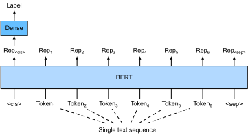
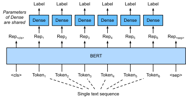

# 시퀀스 레벨 및 토큰 레벨 애플리케이션을 위한 BERT 미세 조정
:label:`sec_finetuning-bert`

이 장의 이전 섹션에서는 RNN, CNN, 주의 및 MLP 기반과 같은 자연어 처리 응용 프로그램에 대한 다양한 모델을 설계했습니다.이러한 모델은 공간 또는 시간 제약이 있을 때 유용하지만 모든 자연어 처리 작업에 대한 특정 모델을 만드는 것은 사실상 불가능합니다.:numref:`sec_bert`에서는 광범위한 자연어 처리 작업을 위해 최소한의 아키텍처 변경이 필요한 사전 학습 모델인 BERT를 도입했습니다.한편, 제안 당시 BERT는 다양한 자연어 처리 작업에 대한 최첨단 기술을 개선했습니다.반면 :numref:`sec_bert-pretraining`에서 언급한 바와 같이 원래 BERT 모델의 두 버전에는 1억 1천만 및 3억 4천만 개의 매개변수가 제공됩니다.따라서 계산 리소스가 충분한 경우 다운스트림 자연어 처리 응용 프로그램을 위해 BERT를 미세 조정하는 것을 고려할 수 있습니다. 

다음에서는 자연어 처리 응용 프로그램의 하위 집합을 시퀀스 수준 및 토큰 수준으로 일반화합니다.시퀀스 수준에서는 단일 텍스트 분류 및 텍스트 쌍 분류 또는 회귀에서 텍스트 입력의 BERT 표현을 출력 레이블로 변환하는 방법을 소개합니다.토큰 수준에서는 텍스트 태그 지정 및 질문 답변과 같은 새로운 응용 프로그램을 간략하게 소개하고 BERT가 입력을 표현하고 출력 레이블로 변환하는 방법에 대해 설명합니다.미세 조정 중에 다양한 응용 프로그램에서 BERT가 요구하는 “최소한의 아키텍처 변경”은 완전히 연결된 추가 계층입니다.다운스트림 애플리케이션의 지도 학습 중에 사전 훈련된 BERT 모델의 모든 파라미터가 미세 조정되는 동안 추가 계층의 파라미터가 처음부터 학습됩니다. 

## 단일 텍스트 분류

*단일 텍스트 분류*는 단일 텍스트 시퀀스를 입력으로 사용하여 분류 결과를 출력합니다.
이 장에서 연구 한 감정 분석 외에도 언어 수용 코퍼스 (CoLA) 는 주어진 문장이 문법적으로 수용 가능한지 여부를 판단하는 단일 텍스트 분류에 대한 데이터 세트이기도합니다. :cite:`Warstadt.Singh.Bowman.2019`.예를 들어, “공부해야 합니다.” 는 허용되지만 “공부해야 합니다.” 는 그렇지 않습니다. 

:label:`fig_bert-one-seq`

:numref:`sec_bert`는 버트의 입력 표현에 대해 설명합니다.BERT 입력 시퀀스는 단일 텍스트와 텍스트 쌍을 명확하게 나타냅니다. 여기서 특수 분류 토큰 “<cls>" 은 시퀀스 분류에 사용되고 특수 분류 토큰 “<sep>" 은 단일 텍스트의 끝을 표시하거나 텍스트 쌍을 구분합니다.:numref:`fig_bert-one-seq`에서 볼 수 있듯이 단일 텍스트 분류 응용 프로그램에서 특수 분류 토큰 “<cls>” 의 BERT 표현은 전체 입력 텍스트 시퀀스의 정보를 인코딩합니다.입력 단일 텍스트의 표현으로 완전히 연결된 (조밀 한) 레이어로 구성된 작은 MLP에 공급되어 모든 개별 레이블 값의 분포를 출력합니다. 

## 텍스트 쌍 분류 또는 회귀

이 장에서는 자연어 추론도 살펴보았습니다.텍스트 쌍을 분류하는 응용 프로그램 유형인*텍스트 쌍 분류*에 속합니다. 

한 쌍의 텍스트를 입력으로 사용하지만 연속형 값을 출력하는 경우
*의미 론적 텍스트 유사성*은 널리 사용되는*텍스트 쌍 회귀* 작업입니다.
이 작업은 문장의 의미적 유사성을 측정합니다.예를 들어 시맨틱 텍스트 유사성 벤치마크 데이터셋에서 문장 쌍의 유사성 점수는 0 (의미 중복 없음) 에서 5 (의미 동등성) :cite:`Cer.Diab.Agirre.ea.2017`까지의 서수 척도입니다.목표는 이러한 점수를 예측하는 것입니다.시맨틱 텍스트 유사성 벤치마크 데이터셋의 예는 다음과 같습니다 (문장 1, 문장 2, 유사성 점수). 

* “비행기가 이륙하고 있습니다.“, “비행기가 이륙하고 있습니다.“, 5.000;
* “여자가 뭔가를 먹고 있어요.“, “여자가 고기를 먹고 있어요.“, 3.000;
* “여자가 춤을 추고 있어요.“, “한 남자가 말하고 있습니다.“, 0.000.

:label:`fig_bert-two-seqs`

:numref:`fig_bert-one-seq`의 단일 텍스트 분류와 비교할 때 :numref:`fig_bert-two-seqs`의 텍스트 쌍 분류에 대한 BERT를 미세 조정하는 것은 입력 표현에서 다릅니다.의미 론적 텍스트 유사성과 같은 텍스트 쌍 회귀 작업의 경우 연속 레이블 값을 출력하고 평균 제곱 손실을 사용하는 것과 같은 사소한 변경 사항을 적용 할 수 있습니다. 회귀에 일반적입니다. 

## 텍스트 태깅

이제 각 토큰에 레이블이 할당되는*텍스트 태깅*과 같은 토큰 수준 작업을 고려해 보겠습니다.텍스트 태그 작업 중
*품사 태깅*은 각 단어에 품사 태그 (예: 형용사 및 결정자) 를 할당합니다.
문장에서 단어의 역할에 따라 다릅니다.예를 들어, Penn Treebank II 태그 세트에 따르면 “존 스미스의 차는 새롭다”라는 문장은 “NNP (명사, 고유 단수) NP POS (소유 결말) NN (명사, 단수 또는 질량) VB (동사, 기본 형식) JJ (형용사)”. 

:label:`fig_bert-tagging`

텍스트 태그 지정 응용 프로그램을 위한 BERT 미세 조정은 :numref:`fig_bert-tagging`에 설명되어 있습니다.:numref:`fig_bert-one-seq`와 비교할 때 유일한 차이점은 텍스트 태그 지정에서 입력 텍스트의*모든 토큰*에 대한 BERT 표현이 동일한 추가 완전 연결 계층으로 공급되어 품사 태그와 같은 토큰의 레이블을 출력한다는 것입니다. 

## 질문 답변

또 다른 토큰 수준 애플리케이션으로서
*질문 답변*은 독해 능력을 반영합니다.
예를 들어 스탠포드 질문 답변 데이터 세트 (Squad v1.1) 는 구절과 질문을 읽는 것으로 구성되며, 여기서 모든 질문에 대한 답은 질문이 약 :cite:`Rajpurkar.Zhang.Lopyrev.ea.2016`라는 구절의 텍스트 (텍스트 범위) 에 불과합니다.설명하기 위해 “일부 전문가들은 마스크의 효능이 결정적이지 않다고보고합니다.그러나 마스크 제조업체는 N95 인공 호흡기 마스크와 같은 자사 제품이 바이러스로부터 보호 할 수 있다고 주장합니다.” 그리고 “N95 인공 호흡기 마스크가 바이러스로부터 보호 할 수 있다고 누가 말합니까?”답은 구절의 텍스트 범위 “마스크 제작자”여야합니다.따라서 Squad v1.1의 목표는 한 쌍의 질문과 구절이 주어진 구절에서 텍스트 범위의 시작과 끝을 예측하는 것입니다. 

:label:`fig_bert-qa`

질문 응답을 위해 BERT를 미세 조정하기 위해 질문과 구절은 BERT의 입력에서 각각 첫 번째 및 두 번째 텍스트 시퀀스로 압축됩니다.텍스트 범위의 시작 위치를 예측하기 위해 동일한 추가 완전 연결 계층은 토큰의 BERT 표현을 위치 $i$의 통과에서 스칼라 점수 $s_i$로 변환합니다.모든 통과 토큰의 이러한 점수는 소프트맥스 연산에 의해 확률 분포로 더 변환되어, 통로 내의 각 토큰 위치 ($i$) 에 텍스트 스팬의 시작이 될 확률 $p_i$이 할당된다.텍스트 범위의 끝을 예측하는 것은 위와 동일합니다. 단, 완전히 연결된 추가 레이어의 매개 변수는 시작을 예측하는 매개 변수와 독립적입니다.끝을 예측할 때 위치 $i$의 모든 통과 토큰은 동일한 완전 연결 계층에 의해 스칼라 점수 $e_i$으로 변환됩니다. :numref:`fig_bert-qa`는 질문 응답을 위해 BERT를 미세 조정하는 것을 보여줍니다. 

질문 답변의 경우 지도 학습의 훈련 목표는 실측 시작 및 종료 위치의 로그 가능성을 극대화하는 것만큼이나 간단합니다.범위를 예측할 때 위치 $i$에서 위치 $j$ ($i \leq j$) 까지의 유효한 범위에 대한 점수 $s_i + e_j$을 계산하고 가장 높은 점수로 범위를 출력할 수 있습니다. 

## 요약

* BERT는 단일 텍스트 분류 (예: 감정 분석 및 언어 수용 가능성 테스트), 텍스트 쌍 분류 또는 회귀 (예: 자연어) 와 같은 시퀀스 수준 및 토큰 수준의 자연어 처리 응용 프로그램을 위해 최소한의 아키텍처 변경 (추가 완전 연결 계층) 이 필요합니다.추론 및 의미 론적 텍스트 유사성), 텍스트 태그 지정 (예: 품사 태그 지정) 및 질문 답변.
* 다운스트림 애플리케이션의 지도 학습 중에 사전 훈련된 BERT 모델의 모든 파라미터가 미세 조정되는 동안 추가 계층의 파라미터가 처음부터 학습됩니다.

## 연습문제

1. 뉴스 기사에 대한 검색 엔진 알고리즘을 설계해 보겠습니다.시스템에서 쿼리 (예: “코로나바이러스 발생 시 석유 산업”) 를 수신하면 쿼리와 가장 관련성이 높은 뉴스 기사 순위 목록을 반환해야 합니다.방대한 뉴스 기사 풀과 많은 수의 쿼리가 있다고 가정 해 보겠습니다.문제를 단순화하기 위해 각 쿼리에 대해 가장 관련성이 높은 문서에 레이블이 지정되었다고 가정합니다.알고리즘 설계에 음수 샘플링 (:numref:`subsec_negative-sampling` 참조) 과 BERT를 어떻게 적용할 수 있습니까?
1. 학습 언어 모델에서 BERT를 어떻게 활용할 수 있을까요?
1. 기계 번역에 BERT를 활용할 수 있을까요?

[Discussions](https://discuss.d2l.ai/t/396)
