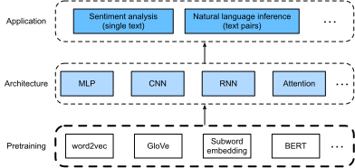

# 자연어 처리: 사전 교육
:label:`chap_nlp_pretrain`

인간은 의사소통이 필요합니다.인간 상태의 이러한 기본적인 필요성에서 매일 방대한 양의 서면 텍스트가 생성되었습니다.소셜 미디어, 채팅 앱, 이메일, 제품 리뷰, 뉴스 기사, 연구 논문 및 도서에 서식있는 텍스트가 주어지면 컴퓨터가 인간의 언어를 기반으로 도움을 제공하거나 의사 결정을 내릴 수 있도록 이해하는 것이 중요합니다. 

*자연어 처리*는 자연어를 사용하여 컴퓨터와 인간 간의 상호 작용을 연구합니다.
실제로 자연어 처리 기술을 사용하여 :numref:`sec_language_model`의 언어 모델 및 :numref:`sec_machine_translation`의 기계 번역 모델과 같은 텍스트 (인간 자연어) 데이터를 처리하고 분석하는 것이 매우 일반적입니다. 

텍스트를 이해하기 위해 텍스트의 표현을 배우는 것으로 시작할 수 있습니다.대기업의 기존 텍스트 시퀀스를 활용하여
*자가 지도 학습*
는 주변 텍스트의 다른 부분을 사용하여 텍스트의 숨겨진 부분을 예측하는 등 텍스트 표현을 사전 학습하는 데 광범위하게 사용되었습니다.이러한 방식으로 모델은*값비싼 라벨 작업 없이 방대한 양의 텍스트 데이터로부터 감독을 통해 학습합니다! 

이 장에서 볼 수 있듯이 각 단어 또는 하위 단어를 개별 토큰으로 취급 할 때 대기업에 word2vec, GLOVE 또는 하위 단어 임베딩 모델을 사용하여 각 토큰의 표현을 사전 학습 할 수 있습니다.사전 훈련 후 각 토큰의 표현은 벡터가 될 수 있지만 컨텍스트가 무엇이든 동일하게 유지됩니다.예를 들어, “은행”의 벡터 표현은 “은행에 가서 돈을 입금하기”와 “은행에 가서 앉기”에서 동일합니다.따라서 최근의 많은 사전 학습 모델은 동일한 토큰의 표현을 다른 컨텍스트에 맞게 조정합니다.그 중에는 트랜스포머 인코더를 기반으로 한 훨씬 더 심층적 인 자체 감독 모델 인 BERT가 있습니다.이 장에서는 :numref:`fig_nlp-map-pretrain`에서 강조한 바와 같이 텍스트에 대한 이러한 표현을 사전 교육하는 방법에 중점을 둘 것입니다. 


:label:`fig_nlp-map-pretrain`

큰 그림을 볼 수 있도록 :numref:`fig_nlp-map-pretrain`는 사전 학습된 텍스트 표현을 다양한 다운스트림 자연어 처리 애플리케이션을 위한 다양한 딥 러닝 아키텍처에 제공할 수 있음을 보여줍니다.우리는 :numref:`chap_nlp_app`에서 그것들을 다룰 것입니다.

```toc
:maxdepth: 2

word2vec
approx-training
word-embedding-dataset
word2vec-pretraining
glove
subword-embedding
similarity-analogy
bert
bert-dataset
bert-pretraining
```
