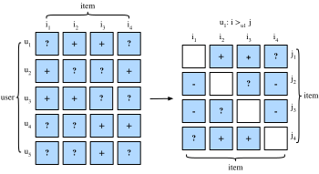

# 추천자 시스템에 대한 맞춤형 순위

이전 섹션에서는 명시적인 피드백만 고려했으며 관찰된 등급에 대해 모델을 교육하고 테스트했습니다.이러한 방법에는 두 가지 단점이 있습니다. 첫째, 대부분의 피드백은 명시적이지는 않지만 실제 시나리오에서는 암시적이며 명시적 피드백은 수집하는 데 더 많은 비용이 들 수 있습니다.둘째, 사용자의 관심사를 예측할 수 있는 관찰되지 않은 사용자 항목 쌍은 완전히 무시되므로 등급이 무작위로 누락되지 않고 사용자의 선호도로 인해 이러한 방법이 적합하지 않습니다.관찰되지 않은 사용자-항목 쌍은 실제 부정적인 피드백 (사용자가 항목에 관심이 없음) 과 결측값 (사용자가 나중에 항목과 상호 작용할 수 있음) 이 혼합된 것입니다.행렬 인수 분해와 AutoREC에서는 관측되지 않은 쌍을 무시합니다.분명히 이러한 모델은 관찰 된 쌍과 관찰되지 않은 쌍을 구별 할 수 없으며 일반적으로 개인화 된 순위 작업에는 적합하지 않습니다. 

이를 위해 암시적 피드백에서 순위가 매겨진 추천 목록을 생성하는 것을 목표로 하는 추천 모델 클래스가 인기를 얻었습니다.일반적으로 개인화된 순위 모델은 점별, 쌍별 또는 목록별 접근 방식으로 최적화할 수 있습니다.점별 접근법은 한 번에 하나의 교호작용을 고려하고 분류기나 회귀자를 훈련시켜 개별 선호도를 예측합니다.행렬 인수 분해와 AutoREC는 점별 대물렌즈를 사용하여 최적화됩니다.쌍별 접근법은 각 사용자에 대해 한 쌍의 항목을 고려하여 해당 쌍의 최적 순서를 근사화하는 것을 목표로 합니다.상대 순서를 예측하는 것은 순위의 특성을 연상시키기 때문에 일반적으로 쌍별 접근법이 순위 지정 작업에 더 적합합니다.목록별 접근법은 전체 항목 목록의 순서를 대략적으로 계산합니다. 예를 들어 정규화된 할인 누적 이득 ([NDCG](https://en.wikipedia.org/wiki/Discounted_cumulative_gain)) 과 같은 순위 측정값을 직접 최적화합니다.그러나 목록별 접근 방식은 점별 또는 쌍별 접근 방식보다 복잡하고 컴퓨팅 집약적입니다.이 섹션에서는 두 가지 쌍별 목표/손실, 베이지안 개인화 순위 손실 및 힌지 손실 및 각 구현에 대해 소개합니다. 

## 베이지안 맞춤형 랭킹 손실 및 구현

베이지안 개인화 순위 (BPR) :cite:`Rendle.Freudenthaler.Gantner.ea.2009`는 최대 사후 추정기에서 파생된 쌍별 개인화된 순위 손실입니다.기존의 많은 추천 모델에서 널리 사용되었습니다.BPR의 훈련 데이터는 양수 쌍과 음수 쌍 (결측값) 으로 구성됩니다.사용자가 관찰되지 않은 다른 모든 항목보다 양수 항목을 선호한다고 가정합니다. 

공식적으로, 훈련 데이터는 $(u, i, j)$의 형태로 튜플에 의해 구성되며, 이는 사용자 $u$이 항목 $j$보다 항목 $i$를 선호한다는 것을 나타냅니다.사후 확률을 최대화하는 것을 목표로하는 BPR의 베이지안 공식은 다음과 같습니다. 

$$
p(\Theta \mid >_u )  \propto  p(>_u \mid \Theta) p(\Theta)
$$

여기서 $\Theta$는 임의 추천 모델의 매개 변수를 나타내고 $>_u$는 사용자 $u$에 대한 모든 항목의 원하는 개인화 된 총 순위를 나타냅니다.최대 사후 추정기를 공식화하여 개인화 된 순위 작업에 대한 일반적인 최적화 기준을 도출 할 수 있습니다. 

$$
\begin{aligned}
\text{BPR-OPT} : &= \ln p(\Theta \mid >_u) \\
         & \propto \ln p(>_u \mid \Theta) p(\Theta) \\
         &= \ln \prod_{(u, i, j \in D)} \sigma(\hat{y}_{ui} - \hat{y}_{uj}) p(\Theta) \\
         &= \sum_{(u, i, j \in D)} \ln \sigma(\hat{y}_{ui} - \hat{y}_{uj}) + \ln p(\Theta) \\
         &= \sum_{(u, i, j \in D)} \ln \sigma(\hat{y}_{ui} - \hat{y}_{uj}) - \lambda_\Theta \|\Theta \|^2
\end{aligned}
$$

여기서 $D := \{(u, i, j) \mid i \in I^+_u \wedge j \in I \backslash I^+_u \}$은 훈련 세트이며, $I^+_u$는 사용자가 $u$가 좋아했던 항목을 나타내고, $I$은 모든 항목을 나타내며, $I \backslash I^+_u$는 사용자가 좋아하는 항목을 제외한 다른 모든 항목을 나타냅니다. $\hat{y}_{ui}$ 및 $\hat{y}_{uj}$은 항목 $i$ 및 $u$에 대한 사용자 $u$의 예측 점수입니다.각각.이전 $p(\Theta)$은 평균이 0이고 분산-공분산 행렬 $\Sigma_\Theta$를 갖는 정규 분포입니다.여기서 우리는 $\Sigma_\Theta = \lambda_\Theta I$을 보냅니다. 

 베이지안 맞춤형 순위 손실을 구성하기 위해 기본 클래스 `mxnet.gluon.loss.Loss`를 구현하고 `forward` 메서드를 재정의합니다.먼저 Loss 클래스와 np 모듈을 임포트합니다.

```{.python .input  n=5}
from mxnet import gluon, np, npx
npx.set_np()
```

BPR 손실의 구현은 다음과 같습니다.

```{.python .input  n=2}
#@save
class BPRLoss(gluon.loss.Loss):
    def __init__(self, weight=None, batch_axis=0, **kwargs):
        super(BPRLoss, self).__init__(weight=None, batch_axis=0, **kwargs)

    def forward(self, positive, negative):
        distances = positive - negative
        loss = - np.sum(np.log(npx.sigmoid(distances)), 0, keepdims=True)
        return loss
```

## 힌지 손실 및 그 구현

순위에 대한 힌지 손실은 SVM과 같은 분류기에서 자주 사용되는 글루온 라이브러리 내에 제공된 [힌지 손실](https://mxnet.incubator.apache.org/api/python/gluon/loss.html#mxnet.gluon.loss.HingeLoss) 과 다른 형식을 갖습니다.추천자 시스템에서 순위에 사용되는 손실은 다음과 같은 형식입니다. 

$$
 \sum_{(u, i, j \in D)} \max( m - \hat{y}_{ui} + \hat{y}_{uj}, 0)
$$

여기서 $m$는 안전 마진 크기입니다.부정적인 항목을 긍정적 인 항목에서 멀어지게하는 것을 목표로합니다.BPR과 마찬가지로 절대 출력 대신 포지티브 샘플과 네거티브 샘플 사이의 관련 거리를 최적화하여 추천자 시스템에 매우 적합합니다.

```{.python .input  n=3}
#@save
class HingeLossbRec(gluon.loss.Loss):
    def __init__(self, weight=None, batch_axis=0, **kwargs):
        super(HingeLossbRec, self).__init__(weight=None, batch_axis=0,
                                            **kwargs)

    def forward(self, positive, negative, margin=1):
        distances = positive - negative
        loss = np.sum(np.maximum(- distances + margin, 0))
        return loss
```

이 두 가지 손실은 개인화 된 추천 순위에 대해 상호 교환 가능합니다. 

## 요약

- 추천자 시스템에서 개인화 된 순위 작업에 사용할 수있는 세 가지 유형의 순위 손실, 즉 점별, 쌍별 및 목록 방법이 있습니다.
- 두 쌍의 손실, 베이지안 맞춤형 순위 손실과 힌지 손실은 서로 바꿔서 사용할 수 있습니다.

## 연습문제

- BPR 및 힌지 손실의 변형이 있습니까?
- BPR 또는 힌지 손실을 사용하는 추천 모델을 찾을 수 있습니까?

:begin_tab:`mxnet`
[Discussions](https://discuss.d2l.ai/t/402)
:end_tab:
