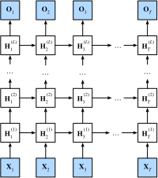

# 심층 순환 신경망

:label:`sec_deep_rnn` 

지금까지는 단일 단방향 은닉 레이어가 있는 RNN에 대해서만 논의했습니다.그 안에서 잠재 변수와 관측치가 상호 작용하는 방식에 대한 특정 기능적 형태는 다소 임의적입니다.서로 다른 유형의 상호 작용을 모델링할 수 있는 유연성이 충분하다면 큰 문제는 아닙니다.그러나 단일 레이어에서는 매우 어려울 수 있습니다.선형 모델의 경우 레이어를 더 추가하여 이 문제를 해결했습니다.RNN 내에서는 비선형성을 추가하는 방법과 위치를 먼저 결정해야하기 때문에 약간 까다 롭습니다. 

실제로 여러 층의 RNN을 서로 쌓을 수 있습니다.그 결과 여러 개의 간단한 레이어가 결합되어 유연한 메커니즘이 생성됩니다.특히 데이터는 스택의 여러 수준에서 관련이 있을 수 있습니다.예를 들어, 금융 시장 상황 (약세 또는 강세장) 에 대한 높은 수준의 데이터를 계속 사용할 수 있지만 낮은 수준에서는 단기 시간적 역학 만 기록합니다. 

위의 모든 추상적 논의 외에도 :numref:`fig_deep_rnn`를 검토하여 관심있는 모델 제품군을 이해하는 것이 가장 쉬울 것입니다.여기에는 $L$개의 숨겨진 레이어가 있는 깊은 RNN이 설명되어 있습니다.숨겨진 각 상태는 현재 레이어의 다음 시간 스텝과 다음 레이어의 현재 시간 스텝 모두에 계속 전달됩니다. 


:label:`fig_deep_rnn`

## 기능적 종속성

:numref:`fig_deep_rnn`에 묘사된 $L$개의 숨겨진 계층의 심층 아키텍처 내에서 기능적 종속성을 공식화할 수 있습니다.다음 논의는 주로 바닐라 RNN 모델에 초점을 맞추고 있지만 다른 시퀀스 모델에도 적용됩니다. 

시간 단계 $t$에 미니배치 입력값 $\mathbf{X}_t \in \mathbb{R}^{n \times d}$ (예제 수: $n$, 각 예제의 입력 수: $d$) 이 있다고 가정합니다.동시에, $l^\mathrm{th}$ 은닉 레이어 ($l=1,\ldots,L$) 의 은닉 상태를 $\mathbf{H}_t^{(l)}  \in \mathbb{R}^{n \times h}$ (은닉 유닛 수: $h$) 이 되고 출력 레이어 변수는 $\mathbf{O}_t \in \mathbb{R}^{n \times q}$ (출력 개수: $q$) 가 되도록 합니다.$\mathbf{H}_t^{(0)} = \mathbf{X}_t$을 설정하면 활성화 함수 $\phi_l$를 사용하는 $l^\mathrm{th}$ 은닉 레이어의 숨겨진 상태는 다음과 같이 표현됩니다. 

$$\mathbf{H}_t^{(l)} = \phi_l(\mathbf{H}_t^{(l-1)} \mathbf{W}_{xh}^{(l)} + \mathbf{H}_{t-1}^{(l)} \mathbf{W}_{hh}^{(l)}  + \mathbf{b}_h^{(l)}),$$
:eqlabel:`eq_deep_rnn_H`

여기서 가중치 $\mathbf{W}_{xh}^{(l)} \in \mathbb{R}^{h \times h}$ 및 $\mathbf{W}_{hh}^{(l)} \in \mathbb{R}^{h \times h}$은 바이어스 $\mathbf{b}_h^{(l)} \in \mathbb{R}^{1 \times h}$와 함께 $l^\mathrm{th}$ 은닉 레이어의 모델 파라미터입니다. 

결국 출력 레이어의 계산은 최종 $L^\mathrm{th}$ 은닉 레이어의 숨겨진 상태에만 기반합니다. 

$$\mathbf{O}_t = \mathbf{H}_t^{(L)} \mathbf{W}_{hq} + \mathbf{b}_q,$$

여기서 가중치 $\mathbf{W}_{hq} \in \mathbb{R}^{h \times q}$와 바이어스 $\mathbf{b}_q \in \mathbb{R}^{1 \times q}$는 출력 계층의 모델 파라미터입니다. 

MLP와 마찬가지로 은닉 레이어 수 $L$와 은닉 유닛 수 $h$은 하이퍼파라미터입니다.즉, 우리가 조정하거나 지정할 수 있습니다.또한 :eqref:`eq_deep_rnn_H`의 은닉 상태 계산을 GRU 또는 LSTM의 은닉 상태 계산으로 대체하여 딥 게이트 RNN을 쉽게 얻을 수 있습니다. 

## 간결한 구현

다행히도 RNN의 여러 계층을 구현하는 데 필요한 많은 물류 세부 정보는 상위 수준 API에서 쉽게 사용할 수 있습니다.단순하게 유지하기 위해 이러한 기본 제공 기능을 사용하는 구현만 설명합니다.LSTM 모델을 예로 들어 보겠습니다.이 코드는 이전에 :numref:`sec_lstm`에서 사용한 코드와 매우 유사합니다.실제로 유일한 차이점은 단일 레이어의 기본값을 선택하는 대신 레이어 수를 명시적으로 지정한다는 것입니다.평소처럼 먼저 데이터세트를 로드합니다.

```{.python .input}
from d2l import mxnet as d2l
from mxnet import npx
from mxnet.gluon import rnn
npx.set_np()

batch_size, num_steps = 32, 35
train_iter, vocab = d2l.load_data_time_machine(batch_size, num_steps)
```

```{.python .input}
#@tab pytorch
from d2l import torch as d2l
import torch
from torch import nn

batch_size, num_steps = 32, 35
train_iter, vocab = d2l.load_data_time_machine(batch_size, num_steps)
```

```{.python .input}
#@tab tensorflow
from d2l import tensorflow as d2l
import tensorflow as tf
batch_size, num_steps = 32, 35
train_iter, vocab = d2l.load_data_time_machine(batch_size, num_steps)
```

하이퍼파라미터 선택과 같은 아키텍처 결정은 :numref:`sec_lstm`의 결정과 매우 유사합니다.우리는 별개의 토큰, 즉 `vocab_size`를 가진 것과 동일한 수의 입력과 출력을 선택합니다.숨겨진 유닛의 수는 여전히 256개입니다.유일한 차이점은 이제 (**`num_layers`.의 값을 지정하여 중요하지 않은 수의 은닉 레이어를 선택합니다**)

```{.python .input}
vocab_size, num_hiddens, num_layers = len(vocab), 256, 2
device = d2l.try_gpu()
lstm_layer = rnn.LSTM(num_hiddens, num_layers)
model = d2l.RNNModel(lstm_layer, len(vocab))
```

```{.python .input}
#@tab pytorch
vocab_size, num_hiddens, num_layers = len(vocab), 256, 2
num_inputs = vocab_size
device = d2l.try_gpu()
lstm_layer = nn.LSTM(num_inputs, num_hiddens, num_layers)
model = d2l.RNNModel(lstm_layer, len(vocab))
model = model.to(device)
```

```{.python .input}
#@tab tensorflow
vocab_size, num_hiddens, num_layers = len(vocab), 256, 2
num_inputs = vocab_size
device_name = d2l.try_gpu()._device_name
strategy = tf.distribute.OneDeviceStrategy(device_name)
rnn_cells = [tf.keras.layers.LSTMCell(num_hiddens) for _ in range(num_layers)]
stacked_lstm = tf.keras.layers.StackedRNNCells(rnn_cells)
lstm_layer = tf.keras.layers.RNN(stacked_lstm, time_major=True,
                                 return_sequences=True, return_state=True)
with strategy.scope():
    model = d2l.RNNModel(lstm_layer, len(vocab))
```

## [**교육**] 및 예측

이제 LSTM 모델을 사용하여 두 계층을 인스턴스화하기 때문에 이 다소 복잡한 아키텍처는 훈련 속도를 상당히 늦춥니다.

```{.python .input}
#@tab mxnet, pytorch
num_epochs, lr = 500, 2
d2l.train_ch8(model, train_iter, vocab, lr, num_epochs, device)
```

```{.python .input}
#@tab tensorflow
num_epochs, lr = 500, 2
d2l.train_ch8(model, train_iter, vocab, lr, num_epochs, strategy)
```

## 요약

* 깊은 RNN에서 은닉 상태 정보는 현재 레이어의 다음 시간 스텝과 다음 레이어의 현재 시간 스텝으로 전달됩니다.
* LSTM, GRU 또는 바닐라 RNN과 같은 다양한 맛의 깊은 RNN이 존재합니다.편리하게도 이러한 모델은 모두 딥 러닝 프레임워크의 상위 수준 API의 일부로 사용할 수 있습니다.
* 모델을 초기화하려면 주의가 필요합니다.전반적으로 심층 RNN은 적절한 수렴을 보장하기 위해 상당한 양의 작업 (예: 학습률 및 클리핑) 이 필요합니다.

## 연습문제

1. :numref:`sec_rnn_scratch`에서 논의한 단일 계층 구현을 사용하여 처음부터 2계층 RNN을 구현해 보십시오.
2. LSTM을 GRU로 대체하고 정확도와 훈련 속도를 비교합니다.
3. 여러 책을 포함하도록 교육 데이터를 늘립니다.당혹감 규모에서 얼마나 낮게 갈 수 있습니까?
4. 텍스트를 모델링할 때 서로 다른 작성자의 소스를 결합하시겠습니까?이게 왜 좋은 생각일까요?무엇이 잘못 될 수 있을까요?

:begin_tab:`mxnet`
[Discussions](https://discuss.d2l.ai/t/340)
:end_tab:

:begin_tab:`pytorch`
[Discussions](https://discuss.d2l.ai/t/1058)
:end_tab:
